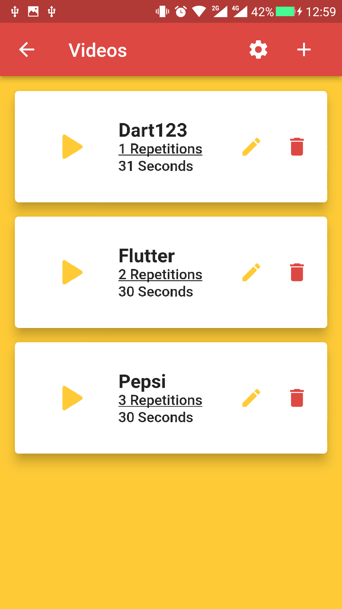
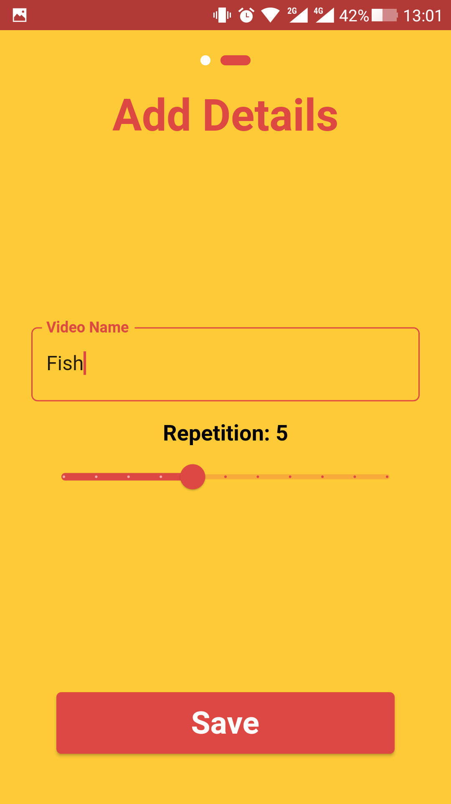

# video_algorithm

## APK Link [Touch Me!](https://drive.google.com/file/d/1hOsh0kXDQSl1gf9ksXnU5Xznm7Q7pnnd/view?usp=sharing)

## Question
play videos from a directory
2. every video have their play repetition | can use database or make
assumption on model
3. algorithm must be made in such manner that every video must be played
but the video with high repetition must be played more than other

eg.
xyz.mp4 is set to 50 repeat,
abc.mp4 is set to 10 repeat,
pqr.mp4 is set to 5 repeat

on every pqr.mp4 is played , abc.mp4 should already be played 2 times
and xyz.mp4 should already be played 10 times

1 timer video : A fixed time is set and at that time whichever video is
being playing that should be pause and play that video which was set for
that time, after played continue the paused video

## Algorithm

## Some Screenshots

 
